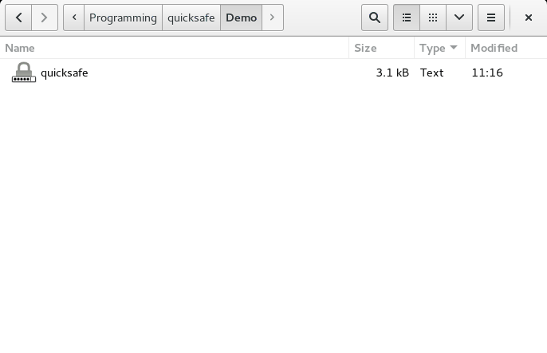

# *quicksafe* - The easiest way to securely encrypt notes

quicksafe is a tiny Python script that provides a GUI text editor to edit notes that are then encrypted and **stored within the script file itself.**

Thus notes encrypted with the system bring their own secure editing environment, capable of running anywhere Python/Tk can run, perfect for archiving, sending by mail or posting online.



To use quicksafe, simply [download the script](quicksafe), make it executable (`chmod +x quicksafe`), create a copy named whatever you want (e.g. `My Secret Diary`), and run it. Changes are saved automatically when you close the editor. The first time you close, you will be asked to set a password, which will be required thereafter in order to open the file. To change the password, make a fresh copy of the original `quicksafe` script, open it, copy and paste your text into the editor and choose a new password when you close it.

## Features

* **Strong security:** [256-bit AES](http://en.wikipedia.org/wiki/Advanced_Encryption_Standard) symmetric encryption in [cipher-block chaining](http://en.wikipedia.org/wiki/Block_cipher_mode_of_operation#Cipher-block_chaining_.28CBC.29) mode.
* **Compact footprint:** The overhead from the script is only 3 KB and all text is [zlib](http://en.wikipedia.org/wiki/Zlib)-compressed before encrypting, meaning that the entire file comprising script and data is usually *smaller* in size than the raw text (while remaining pure ASCII).
* **Cross-platform:** Runs on :checkered_flag: **Windows**, :apple: **OS X** and :penguin: **Linux** without modifications.
* **Code you can trust because you can understand it:** Less than 70 lines of functional program code, all highly readable! Audit the entire program yourself in a matter of minutes, or hack it to do whatever you want in a matter of seconds.

## Requirements
* [Python 2](https://www.python.org/)
* [Tkinter](https://wiki.python.org/moin/TkInter)
* [PyCrypto](https://www.dlitz.net/software/pycrypto/)

### Windows

First install Python 2 using the [Windows installer](https://www.python.org/downloads/windows/). This will also install Tk/Tkinter. Now follow the [instructions to install setuptools](https://pypi.python.org/pypi/setuptools#windows-simplified). You should then be able to run

```
easy_install pycrypto
```

from your Python `Scripts` directory.

### OS X

Python and Tkinter are installed by default on most Macs, so a simple

```
sudo easy_install pycrypto
```

should take care of the requirements.

### Ubuntu

```
sudo apt-get install python-dev python-tk
sudo easy_install pycrypto
```

### Fedora

```
sudo yum install python-devel tkinter
sudo easy_install pycrypto
```

## Potential security issues

While quicksafe is running, your password and the contents of the editor are kept in your computer's memory **in plain text.** quicksafe makes no attempt to safeguard that data in memory, nor to protect you from keyloggers, screen monitoring tools or other software that may be used to record your password and/or the contents of your file while it is in a decrypted state.

Note also that the security provided by quicksafe is conditional on that of the encryption algorithm used (AES), its implementation (PyCrypto), and, of course, on the quality of your password.

## License

Copyright © 2014 Philipp Emanuel Weidmann (<pew@worldwidemann.com>)

Released under the terms of the [MIT License](http://opensource.org/licenses/MIT)
